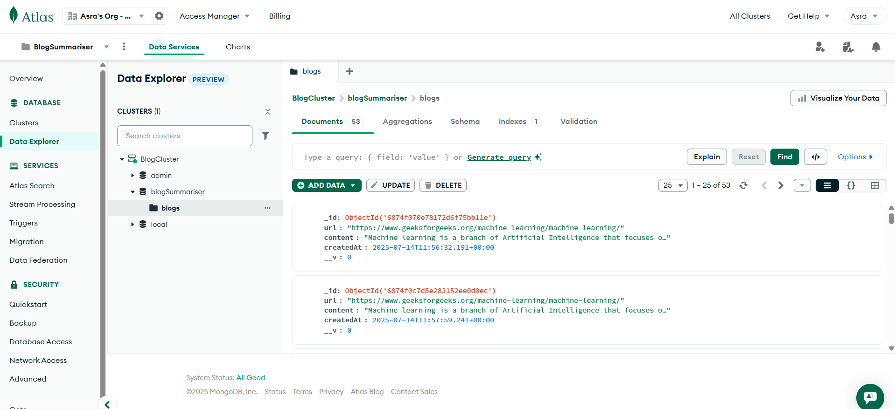
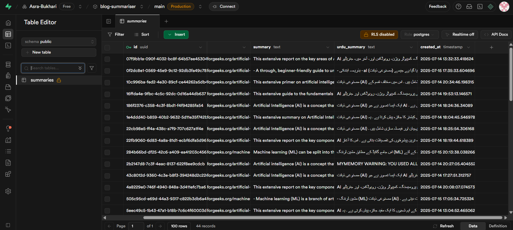
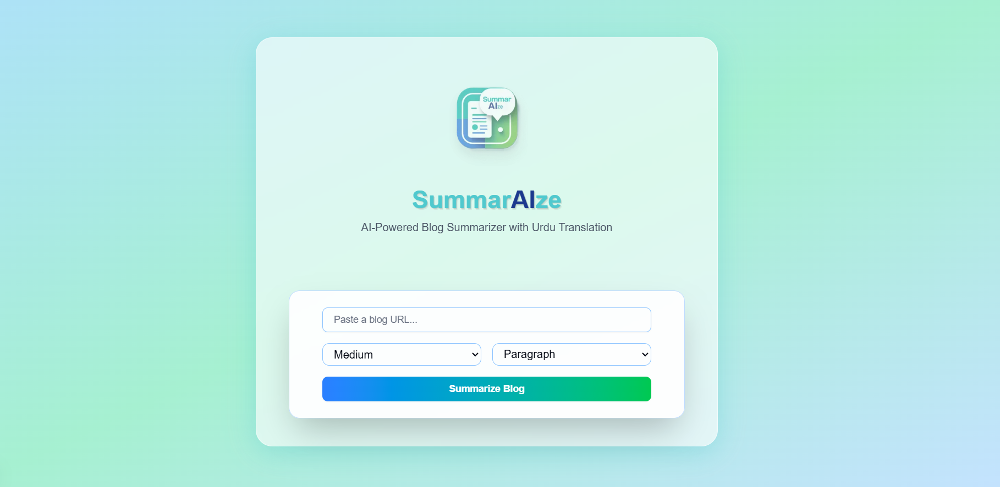
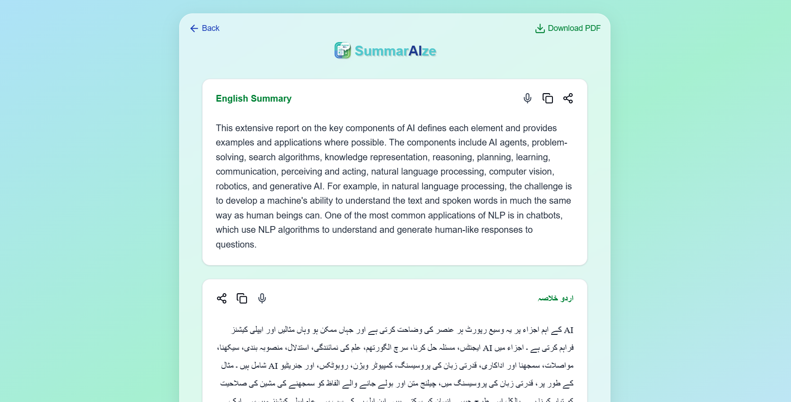
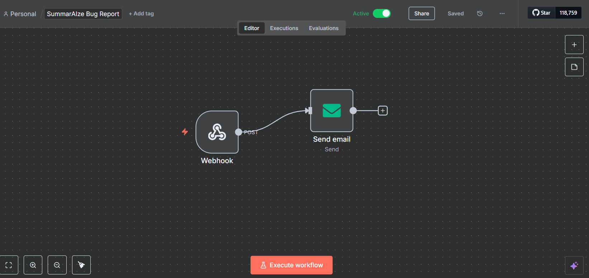

<h1 align="center">SummarAIze</h1>
<p align="center"><i>AI-Powered Blog Summarizer with Urdu Translation</i></p>

---

**SummarAIze** is a full-stack AI-powered web app that allows users to input any blog/article URL and instantly receive:
- ✍️ A concise **English summary**
- 💬 A translated **Urdu version** of the summary

This project uses modern technologies like **Next.js**, **Cohere AI**, **MongoDB**, **Supabase**, and beautiful Tailwind-styled animations for a smooth and engaging user experience.

---

## 🚀 Features

| Feature                                   | Description                                                                    |
| ------------------------------------------|------------------------------------------------------------------------------- |
| 🔗 Blog Summarization                     | Accepts a blog URL and fetches its content                                     |
| 🧠 AI-Powered Summary                     | Uses Cohere API to summarize extracted text                                    |
| 🌐 Urdu Translation                       | Auto-translates the summary into Urdu                                          |
| 📏 Summary Customization                  | User selects **length** (short/medium/long) and **format** (paragraph/bullets) |
| 🧾 PDF Download                           | Download English summary in PDF format                                         |
| 🐞 Bug Reporting Automation               | Errors are reported to via **n8n Webhook + Gmail** integration                 |
| 🐳 Docker Support                         | Run the app in a fully containerized setup using **Docker Compose**            |
| 📱 Mobile Responsive UI                   | Fully responsive, animated, and polished interface                             |
| 🧩 State Management                       | LocalStorage to persist results during navigation                              |
| 🗂️ History (via Supabase & MongoDB Atlas) | Stores past summaries and blogs for future reference                           |


---

## 🧱 Technologies Used

| Stack        | Details                                                              |
| ------------ | -------------------------------------------------------------------- |
| **Frontend** | Next.js 14, Tailwind CSS, Framer Motion                              |
| **Backend**  | API Routes in Next.js                                                |
| **AI**       | Cohere Summarizer AI                                                 |
| **DBs**      | MongoDB for user/blog storage<br>Supabase for optional analytics     |
| **PDF**      | jsPDF for generating downloadable PDF summaries                      |
| **Infra**    | Docker + Docker Compose support, n8n cloud                           |

---

## 🧬 Project Structure

```bash
├── components/
│   ├── InputForm.tsx         # URL form & loading
│   ├── LoadingView.tsx       # Typing animation and delays
│   ├── SummaryCard.tsx       # English summary display
│   ├── UrduCard.tsx          # Urdu summary display
│
├── app/
│   ├── api/summarize
│   │       ├──  route.ts      # API route for summarizing,translating,storing
│   ├── result
│   │       ├──  page.tsx      # Result page i.e summaries
│   ├── page.tsx              # Iutput page
│   ├── globals.css           # Custom fonts and styles
│
├── public/
│   ├── logo.png              # App logo
│   ├── favicon.ico           # favicon icon
│   ├── fonts                 # Urdu font
│   
├── lib/
│   ├── cohere.ts             # Get summary by cohere
│   ├── mongo.ts              # Mongodb atlas connection
│   ├── supabase.ts           # Supabase connection
│   ├── translator.tsx        # Translate using mymemory
│   
├── utils/
│   ├── bugReporter.ts        # Report bug via n8n cloud
│   ├── scraper.ts            # Scrape the blog text to one string
│
├── Dockerfile                # Build process
├── docker-compose.yaml       # Configuration and Deployment
```


## 📁 Environment Variables

| Variable         | Purpose                                                             |
| ---------------- | ------------------------------------------------------------------- |
| `COHERE_API_KEY` | Used to call the Cohere Summarize API                               |
| `MONGODB_URI`    | Connects to MongoDB Atlas for storing parsed blog content           |
| `SUPABASE_URL`   | URL for your Supabase project (optional logging/history support)    |
| `SUPABASE_KEY`   | Supabase anon/public key used to access Supabase tables client-side |


---

## 📊 Databases

<h3>🟢 MongoDB</h3>

<table>
  <tr>
    <td width="60%">
      <ul>
        <li>Used to store <strong>blog content</strong>, summaries, and optionally users.</li>
        <li>Connected via <code>MONGODB_URI</code></li>
        <li><strong>Collection</strong>: <code>blogs</code></li>
      </ul>
    </td>
    <td>
      
    </td>
  </tr>
</table>


<h3>🟣 Supabase</h3>

<table>
  <tr>
    <td width="60%">
      <ul>
        <li>Used to store <strong>summary metadata</strong> and history.</li>
        <li>Connected via <code>SUPABASE_URL</code> and <code>SUPABASE_KEY</code></li>
        <li><strong>Table</strong>: <code>summaries</code></li>
      </ul>
    </td>
    <td>
      
    </td>
  </tr>
</table>


---

## 📸 Demo

Try it live: [https://summarize.vercel.app/](https://summarize.vercel.app/)


---

## 📸 Screenshots

| Home Page                       | Result Page                         |
| ------------------------------- | ----------------------------------- |
|  |  |


---

## 👨‍💻 Local Development 

```bash
git clone https://github.com/yourusername/summarAIze.git
cd summarAIze
npm install
touch .env   # Paste your environment keys
npm run dev
```

Visit: `http://localhost:3000`

---

## 🐳 Docker Support

Easily run the entire app locally via:

```bash
docker-compose up --build
```

---

## 📬 Bug Reporting with n8n

If any **server-side error** occurs — such as scraping failures, API timeouts, or translation issues — the app will automatically send an email to the developer with all relevant details.

<h3>🐞 Bug Report Automation</h3>

<table>
  <tr>
    <td width="60%">
      <ul>
        <li>✅ Automatically triggered on server errors</li>
        <li>📩 Sends HTML-formatted emails using <strong>Gmail SMTP</strong></li>
        <li>🔁 Powered by <strong>n8n Webhook + Send Email</strong> node</li>
        <li>🔧 Configured in <code>utils/bugReporter.ts</code></li>
        <li>🕵️ Email includes:
          <ul>
            <li>Blog <strong>URL</strong></li>
            <li><strong>Error</strong> message</li>
            <li><strong>Timestamp</strong> of the issue</li>
          </ul>
        </li>
      </ul>
    </td>
    <td>
      
    </td>
  </tr>
</table>


> This helps the developer (me) get notified immediately when something goes wrong.

---

## 👩‍🎓 Author

**Asra Bukhari**  

- 🐙 GitHub: [@Asra-Bukhari](https://github.com/Asra-Bukhari)  
- 📁 Repo: [SummarAIze](https://github.com/Asra-Bukhari/summarize)

---

## 📜 License

This project is **open-source** and available for use in **learning**, **research**, and **educational** projects.  
Attribution is appreciated. 💙

